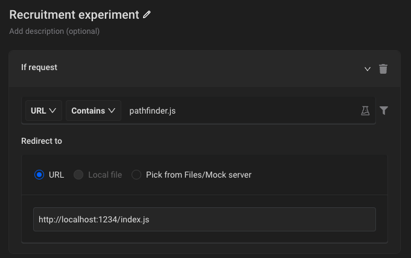

# Experiment creator

## Quick start

1. Install `node`, and `yarn` or `npm`.
2. Set node to correct version (specified in `.nvmrc`).
3. Run `yarn` or `npm` to install dependencies.
4. Run below command to start dev server for an experiment:
   `npx parcel src/YOUR_EXPERIMENT_MODULE/index.js`
5. Preview the experiment on Fandom websites (see the section below)
6. You are all set and ready for coding. :)

## Create new experiment

1. Create new folder in `src` dir with name of your module. You can copy `src/_Template` as a starting point for your experiment. Experiment module requires only `index.js|ts|tsx` file.
2. Run dev server to compile the code.

```bash
npx parcel src/YOUR_EXPERIMENT_MODULE/index.js
```

3. Open `http://localhost:1234/index.js` - you will see compiled code of your experiment.

## Preview the experiment on Fandom websites

1. Add  [Requestly extension](https://requestly.io/) to your browser.
2. Set up a new Requestly rule:
   1. Click **New rule** and select **Redirect request**
   2. Set up the rule to redirect request to `http://localhost:1234/index.js` if URL contains `pathfinder.js`
   
3. Open any Fandom website to verify if Requestly rule is activated and redirects a request.
4. After making changes in your code, you need to reload the page.
